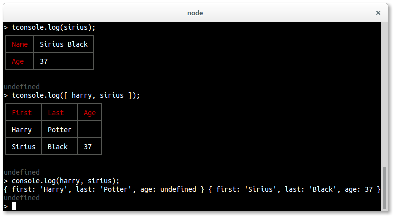

# tconsole



tconsole is a drop-in replacement for node's default console that renders objects as tables in your terminal.

## Installation

Use NPM:

```shell
$ npm install tconsole
```

## How to use it

You can override the `console` object itself or assign tconsole to another variable. It's completely safe to override the native console object because tconsole calls native console methods for methods that are already available in it or objects that are not defined to use with tconsole.

```
var config = { ... };
console = require('tconsole')(config);

console.log(new Person('Harry', 'Potter'));
console(new Person('Sirius', 'Black'), [ 'First', 'Last' ]);
```

tconsole only modifies the predefined `console.log` method to check if there is a special rendering for the given objects. Call `console(object, fields)` to specify which fields should be printed. Use `'*'` for `fields` to print all available fields.

## Example

```
function Person(first, last, age) {
  this.first = first;
  this.last = last;
  this.age = age;
}

var personFields = {
  'First': function() { return this.first; },
  'Last': function() { return this.last; },
  'Name': function() { return this.first+' '+this.last; },
  'Age': function() { return this.age; }
};

var config = {
  'person': {
    test: function() {
      return (this instanceof Person);
    },
    fields: personFields,
    defaultFields: [
      'Name',
      'Age'
    ],
    vertical: true
  },
  'array:person': {
    defaultFields: [
      'First',
      'Last',
      'Age'
    ]
  }
};

var harry = new Person('Harry', 'Potter');
var sirius = new Person('Sirius', 'Black', 37);

var tconsole = require('tconsole')(config);

// use 'single person' renderer
tconsole.log(sirius);

// use automatically derived 'array:person' renderer
tconsole.log([ harry, sirius ]);

// set the shown fields
tconsole(harry, [ 'First', 'Last', 'Name' ]);
```

## Configuration

The configuration object taken by tconsole is an attribute-value pair specifying the renderer objects. The name of the renderer does not matter at all.

```
var config = {
  'name your renderer': some_renderer,
  ...
};
```

If you use tconsole with an array as input, it will automatically try to find an appropriate renderer all of the array elements. To configure the output for such an array you can add a config prefixed by `array:`.

### renderer.test()

Function that is called on the given object to check if this renderer is appropriate. `this` bound to input. If the input is an array, tconsole will run the `renderer.test` function on all array elements to determine the appropriate renderer.

### renderer.insert(table, renderer, fields)

Function that gets called on the given input to generate the table entries. `this` bound to input. Optional, default loops over all elements.

### renderer.fields

Object with functions to compute the value of the requested field. You can use a string instead of function to get a constant value which is useful for table separators.

### renderer.defaultFields

Array of field names that are shown if the fields are not explicitly set. Optional, default is `Object.keys(renderer.fields)`.

### renderer.headers

tconsole will print table headers by default only for array inputs. Use this boolean flag to set it explicitly.

## Further tools to work with `tconsole`

### Combine tconsole instances

If you have multiple modules that provide tconsoles, you may want to use a single tconsole instance instead. By using `tconsole.combine` it is possible to merge the functionalities of several tconsole instances:

```
var tconsole = require('tconsole');
var konsole1 = tconsole(config1);
var konsole2 = tconsole(config2);

// merge the instances
var konsole = tconsole.combine(konsole1, konsole2);
// and use like before
konsole.log(...);
```

### Load all renderers of a directory

Load all renderers defined in separate files in a directory:

```
var tconsole = require('tconsole').load('./renderers');
```
